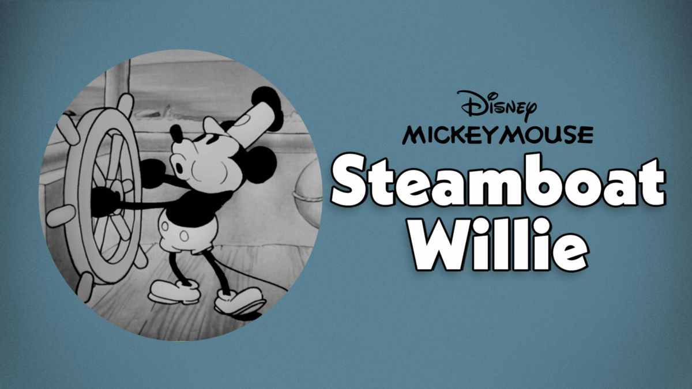

# Steamboat Willie 

Disney's Steamboat Willie is a landmark in the history of animation. The first film starring Mickey Mouse to be released with synchronized sound, it threw silent animation into obsolescence and launched an empire. 

## The Challenge

